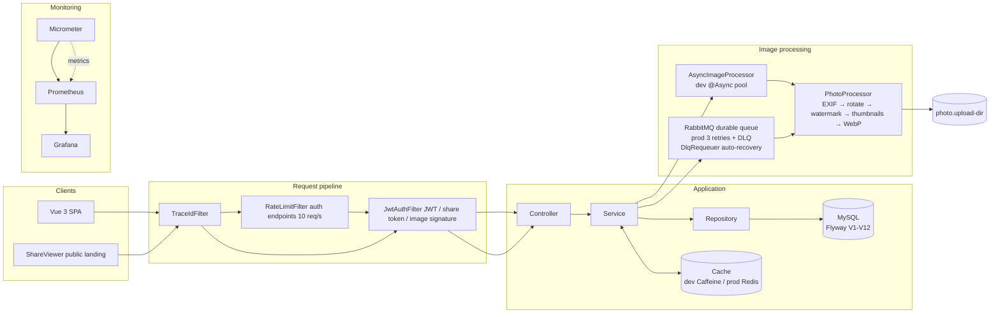

# Photo Gallery · Photo Manager

> A minimalist full-stack photo management app — a private gallery for friends

[简体中文](README.md) | English

A Spring Boot 3 + Vue 3 single-page app (the frontend build is embedded in the backend JAR in production, served from one origin). Konami challenge-response gate + JWT sessions; EXIF timeline/map, album grouping, photo editing, watermarking, WebP, FULLTEXT Chinese search, async image processing (dev `@Async` / prod RabbitMQ), revocable share links, backup export, PWA offline, one-command Docker deployment. k6 load-test results for the list API: see [BENCHMARK.md](BENCHMARK.md).

## Architecture



**Profile switch points**: cache Caffeine (dev) ↔ Redis (prod); image processing @Async (dev) ↔ RabbitMQ (prod).

## Tech Stack

Java 17 · Spring Boot 3.3.13 · MySQL 8 (FULLTEXT + ngram) · Redis · RabbitMQ · Micrometer + Prometheus + Grafana · Vue 3 + TypeScript + ant-design-vue · Vite · Pinia · Leaflet · uPlot · PWA (Workbox) · Docker Compose

## Feature Highlights

- **Photo management** — drag & drop / batch upload (client compression + progress), virtual scrolling (smooth at 10k+ photos), SHA-256 dedup, batch edit/delete, FULLTEXT Chinese search, sort by date/name/size
- **Image processing** — upload returns instantly; EXIF → rotate → watermark → thumbnails (200/400px) → WebP run async; one-click retry + scheduled recovery sweep
- **Taxonomy** — categories (exclusive) / tags (many-to-many, custom colors) / albums (many-to-many, covers + "unassigned" aggregate)
- **EXIF & browsing** — EXIF detail panel, timeline, map (WGS-84 → GCJ-02)
- **Security** — Konami challenge-response gate (sequence server-side only), IP rate limit + failure ban, revocable share links (DB token + whitelist + enforced permission), HMAC short-lived signed image URLs (no JWT in URLs), soft delete + trash + toast undo, unified validation
- **Other** — backup export (zip + pre-generated cache), stats panel, PWA offline, bilingual UI, light/dark theme, six-service Docker Compose

## Quick Start

```bash
# 1. Prepare the database (local MySQL 8)
CREATE DATABASE IF NOT EXISTS photodb CHARACTER SET utf8mb4 COLLATE utf8mb4_unicode_ci;

# 2. Configure local secrets (copy the template and fill in your MySQL password)
cd backend/src/main/resources && cp application-local.yml.example application-local.yml

# 3. Start (dev profile: Caffeine + @Async, no Redis/RabbitMQ needed)
cd ../.. && mvn spring-boot:run -Dspring-boot.run.profiles=dev
# in another terminal
cd frontend && npm install && npm run dev     # http://localhost:5173
```

Unlock on first use with the Konami sequence **↑↑↓↓←→←→BABA**. Full steps (build/deploy/backup/monitoring) are in the [details doc](docs/photo-gallery-details.en.md).

## Technical Choices & Trade-offs

| Decision | Why |
|----------|-----|
| **MySQL FULLTEXT + ngram instead of Elasticsearch** | ES needs ≥256MB extra memory on a 2GB server; FULLTEXT bigram tokenization is enough for photo names/descriptions, and the H2 test environment has a LIKE fallback to keep behavior consistent |
| **Rate limit / ban / nonce stay in single-machine memory** | On a single instance, Redis-backed counters add a strong dependency with zero benefit; multi-instance public deployment is the upgrade signal (then INCR + EXPIRE) |
| **HMAC time-bucket signed image URLs** | `` can't carry an Authorization header; time buckets (300s ±1 sliding window) keep cached list responses valid across buckets without per-response refresh |
| **Soft delete via `@SQLRestriction`** | Global filtering avoids per-query conditions; the cost is that native SQL bypasses it (manually patched `deleted_at` + tests), and it doesn't fit audit-field / multi-tenant scenarios |

## Testing & Quality

419 JUnit tests (JaCoCo 76% instructions measured) · 135 Vitest · 14 Playwright E2E · SpotBugs 0 bugs · Husky + commitlint · CI: four-job pipeline (frontend → backend → docker/e2e)

## Links

- [Details (features / structure / deployment / ops)](docs/photo-gallery-details.en.md)
- [k6 benchmark results](BENCHMARK.md)
