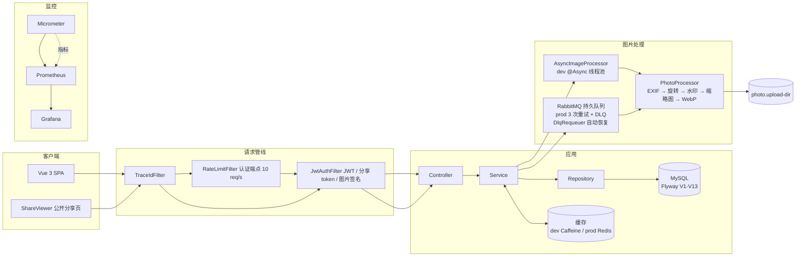

# Photo Gallery · 照片管理器

> 极简全栈照片管理应用 — 朋友间的私人图库

[English](README.en.md) | 简体中文

Spring Boot 3 + Vue 3 单页应用（生产环境前端产物内嵌后端 JAR 同源伺服）。Konami Challenge-Response 门禁 + JWT 会话；EXIF 时间线/地图、相册分组、图片编辑、水印、WebP、FULLTEXT 中文搜索、异步图片处理（dev `@Async` / prod RabbitMQ）、限时分享链接、备份导出、PWA 离线、Docker 一键部署。列表接口 k6 实测数据见 [BENCHMARK.md](BENCHMARK.md)。

## 架构



**Profile 切换点**：缓存 Caffeine（dev）↔ Redis（prod）；图片处理 @Async（dev）↔ RabbitMQ（prod）。

## 技术栈

Java 17 · Spring Boot 3.3.13 · MySQL 8 (FULLTEXT + ngram) · Redis · RabbitMQ · Micrometer + Prometheus + Grafana · Vue 3 + TypeScript + ant-design-vue · Vite · Pinia · Leaflet · uPlot · PWA (Workbox) · Docker Compose

## 功能速览

- **照片管理** — 拖拽/批量上传（客户端压缩 + 进度条）、虚拟滚动（万张不卡，k6 1 万行实测：缓存命中 p95 8ms / 冷回源 32ms）、SHA-256 去重、批量编辑/删除、FULLTEXT 中文搜索、时间/名称/大小排序
- **图片处理** — 上传即返回，异步完成 EXIF → 旋转 → 水印 → 缩略图（200/400px）→ WebP；失败一键重试 + 定时兜底重扫
- **分类体系** — 分类（互斥）/标签（多对多，自定义颜色）/相册（多对多，封面 + 未分配汇总）
- **EXIF 与浏览** — EXIF 详情面板、时间线、地图（WGS-84 → GCJ-02）
- **安全** — Konami Challenge-Response 门禁（序列只存后端）、IP 限流 + 失败封禁、可撤销分享链接（DB token + 白名单 + permission 强制）、HMAC 短时签名图片 URL（JWT 不进 URL）、软删除 + 回收站 + Toast 撤销、统一参数校验
- **其他** — 备份导出（zip + 预生成缓存）、统计面板、PWA 离线、中英双语、明暗主题、Docker Compose 六服务一键部署

## 快速开始

```bash
# 1. 准备数据库（本机 MySQL 8）
CREATE DATABASE IF NOT EXISTS photodb CHARACTER SET utf8mb4 COLLATE utf8mb4_unicode_ci;

# 2. 配置本地密钥（复制模板并填入 MySQL 密码）
cd backend/src/main/resources && cp application-local.yml.example application-local.yml

# 3. 启动（dev profile：Caffeine + @Async，无需 Redis/RabbitMQ）
cd ../.. && mvn spring-boot:run -Dspring-boot.run.profiles=dev
# 另开终端
cd frontend && npm install && npm run dev     # http://localhost:5173
```

首次使用按 Konami 序列 **↑↑↓↓←→←→BABA** 解锁。完整步骤（构建/部署/备份/监控）见 [详细说明](docs/photo-gallery-详细说明.md)。

## 技术选型与权衡

| 决策 | 为什么 |
|------|--------|
| **弃 ES 用 MySQL FULLTEXT + ngram** | 2GB 内存服务器上 ES 至少多占 256MB；FULLTEXT 双字分词对照片名/描述足够，且 H2 测试环境有 LIKE 兜底保持行为一致 |
| **限流/封禁/Nonce 留在单机内存** | 单实例部署下 Redis 集中计数收益为零，反而多一个强依赖；公网多实例是升级信号（届时 INCR + EXPIRE） |
| **图片 URL 用 HMAC 时间桶签名** | `` 带不了 Authorization 头；时间桶（300s ±1 滑动窗口）让缓存的列表响应跨桶依然有效，无需随响应刷新 |
| **软删除用 `@SQLRestriction`** | 全局过滤免去逐查询补条件；代价是原生 SQL 会绕过（已手动补 `deleted_at` + 测试兜底），审计字段/多租户场景不适用 |

## 测试与质量

后端 463 条 JUnit（surefire 汇总 465，JaCoCo 实测 79% 指令）· 前端 143 条 Vitest · 14 条 Playwright E2E · SpotBugs 0 bug · Husky + commitlint · CI 四 job 流水线（frontend → backend → docker/e2e）

## 链接

- [详细说明（功能/结构/部署/运维）](docs/photo-gallery-详细说明.md)
- [k6 压测结果](BENCHMARK.md)
